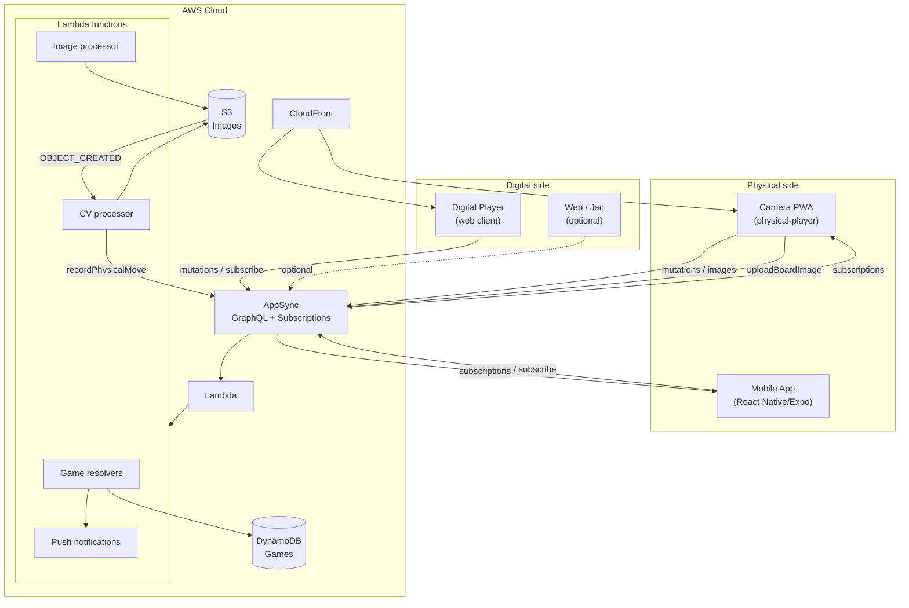
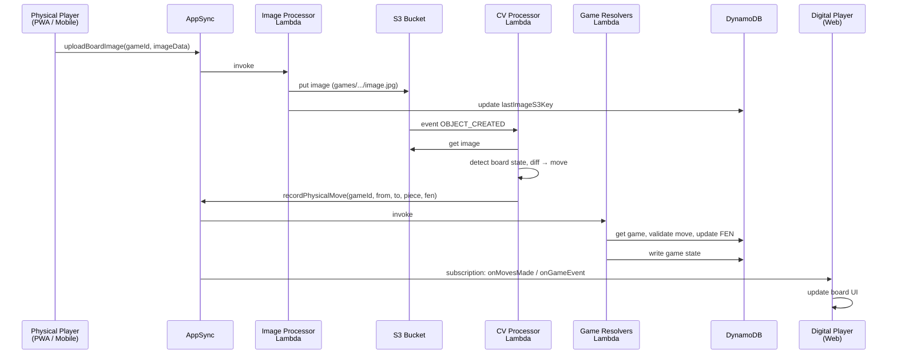
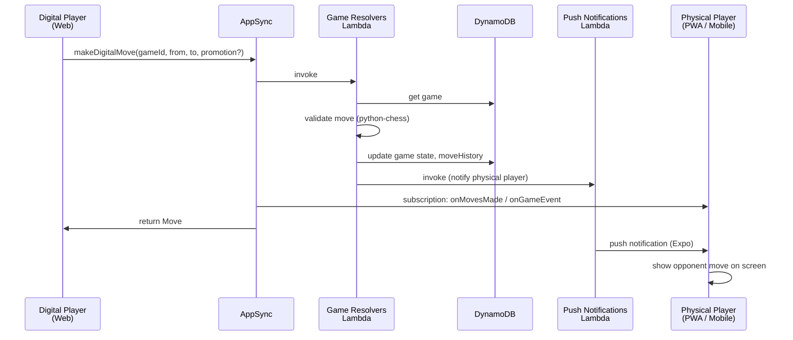
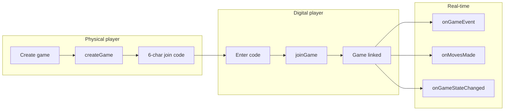

# Checkpoint Architecture

**Open-source DGT board alternative: physical chess board + phone camera + computer vision + web/mobile clients.**

This document describes the full architecture of the Checkpoint hack: all components, data flows, deployment paths, and how the pieces fit together.

---

## 1. Overview

Checkpoint (product name **ChessLink** in the PRD) lets two people play chess remotely:

- **Physical player**: Uses a real chess set and a smartphone camera. The camera captures the board; computer vision on AWS infers moves.
- **Digital player**: Plays in a browser (or optionally via the same backend) on an interactive web board.

No DGT or other electronic board hardware is required—only a normal chess set and a phone.

### Problem & Solution

| Problem | Solution |
|--------|----------|
| DGT boards are expensive ($400–$800+) | Phone camera + cloud CV instead of hardware sensors |
| No cheap way to play physical vs remote | One app for camera/board, one for the remote digital board |
| Complex real-time sync | AWS AppSync (GraphQL + subscriptions) for game state and moves |

---

## 2. High-Level Architecture

```
┌─────────────────────────────────────────────────────────────────────────────────────────┐
│                                    CHECKPOINT SYSTEM                                      │
├─────────────────────────────────────────────────────────────────────────────────────────┤
│                                                                                          │
│  PHYSICAL SIDE                    AWS CLOUD                         DIGITAL SIDE         │
│                                                                                          │
│  ┌──────────────────┐             ┌─────────────────────┐            ┌────────────────┐ │
│  │ Physical Player  │             │  AWS AppSync        │            │ Digital Player │ │
│  │                  │  mutations  │  (GraphQL API)       │  mutations │                │ │
│  │ • Camera PWA     │◄───────────►│  + subscriptions    │◄───────────►│ • Web UI       │ │
│  │   (chess-link/   │  images     │                     │  moves     │   (chess-link/ │ │
│  │   web-clients/   │────────────►│  Lambda resolvers    │            │   web-clients/ │ │
│  │   physical-*)    │             │  (game, image, CV)   │            │   digital-*)   │ │
│  │                  │             │                     │            │                │ │
│  │ • Mobile App     │  same       │  DynamoDB (games)    │            │ • Web (Jac)    │ │
│  │   (checkpoint/   │  AppSync    │  S3 (images)        │            │   (web/)       │ │
│  │   React Native)  │◄───────────►│  CloudFront (web)    │            │   optional     │ │
│  └──────────────────┘             └─────────────────────┘            └────────────────┘ │
│           │                                    │                                              │
│           │                                    │ S3 upload → Lambda (CV) → move → AppSync     │
│           └────────────────────────────────────┘                                              │
│                                                                                          │
└─────────────────────────────────────────────────────────────────────────────────────────┘
```

- **Physical**: Camera + calibration + image upload (PWA or mobile app).
- **AWS**: AppSync (GraphQL + real-time), Lambda (game logic, image ingestion, CV pipeline), DynamoDB, S3, CloudFront.
- **Digital**: Browser chess UI (vanilla JS in `chess-link`, or Jac/Jaseci stack in `web/`).

### 2.1 Mermaid Diagrams

**System architecture (component diagram):**



**Physical move flow (sequence):**



**Digital move flow (sequence):**



**Game creation and join flow:**



---

## 3. Repository Layout

| Path | Purpose |
|------|--------|
| **chess-link/** | Main deployable “ChessLink” stack: CDK infra, Lambda, GraphQL, and web clients (physical + digital). |
| **checkpoint/** | React Native/Expo mobile app: camera, push notifications, AppSync client (uses same backend as chess-link). |
| **web/** | Jac/Jaseci chess web app: lobby, digital board, camera UI; can use mock or real backend. |
| **aws/** | Alternative AWS setup via CLI (no CDK): DynamoDB, AppSync, VTL resolvers (e.g. board reset). |
| **lambda/** (root) | Standalone Lambda for board position detection via **AWS Bedrock** (Claude/Nova); `handler.py`; deploy with `./deploy_lambda.sh`. Separate from chess-link CDK Lambdas. |
| **ts-api/** | Reserved for future TypeScript API (currently empty). |
| **deploy_lambda.sh** | Deploy/teardown the root `lambda/` (chesslink-detect-position) to AWS; optional API Gateway and S3 trigger. |
| **deploy-config.sh** | Update AppSync endpoint, region, and API key in web and mobile app config (e.g. after board-reset or CLI deploy). |
| **PRD.md** | Product requirements (vision, flows, APIs, MVP scope). |
| **RESET_BOARD_SETUP.md** | Board reset flow (web → AppSync → mobile). |
| **AWS_CLI_DEPLOYMENT.md** | CLI-based deploy/teardown for the aws/ path. |

---

## 4. Chess-Link (Main Backend & Web Clients)

This is the primary AWS-backed system: one deploy script, one GraphQL API, two web clients.

### 4.1 Infrastructure (AWS CDK)

- **Location**: `chess-link/infrastructure/`
- **Stack**: `CheckpointStack` in `chess_link_stack.py`
- **Deploy**: From `chess-link/`, run `./deploy.sh` (checks deps, builds Lambda, bootstraps CDK if needed, deploys stack, updates web and mobile config, syncs web clients to S3).

**Resources created:**

| Resource | Role |
|----------|------|
| **S3** `checkpoint-images-*` | Board images; CORS for uploads; triggers Lambda on new `games/*.jpg`. |
| **S3** `checkpoint-web-*` | Static hosting for PWA + digital client; CloudFront origin. |
| **DynamoDB** `checkpoint-games` | Game state (id PK); GSI `JoinCodeIndex` (joinCode). |
| **Lambda** (shared layer from `chess-link/lambda`) | Game resolvers, image upload, CV pipeline, push notifications. |
| **AppSync** `checkpoint-api` | GraphQL API (schema in `chess-link/graphql/schema.graphql`), API key auth, Lambda + DynamoDB data sources. |
| **CloudFront** | HTTPS distribution for the web bucket; outputs `WebsiteURL`. |

**Lambda functions:**

- **GameResolvers**: `createGame`, `joinGame`, `makeDigitalMove`, `recordPhysicalMove`, `updatePlayerConnection`, `completeCalibration`, `registerPushToken` (plus push notification invoke).
- **ImageProcessor**: `uploadBoardImage` (decode base64 → S3, update game `lastImageS3Key`).
- **CVProcessor**: Invoked by S3 object create on `games/*.jpg`; runs CV pipeline (currently mock/extensible), then can call AppSync to record physical move.
- **PushNotifications**: Invoked by other Lambdas to send push notifications (e.g. to mobile app).

**AppSync resolvers:**

- Mutations: all game/image/calibration/push mutations → Lambda (game_resolvers or image_processor).
- Queries: `getGame` (and optionally `getGameByJoinCode`) → DynamoDB or Lambda as defined in stack.

### 4.2 GraphQL Schema (AppSync)

- **File**: `chess-link/graphql/schema.graphql`

**Main types:**

- **Game**: id, joinCode, status, currentFEN, currentTurn, physicalPlayerColor, digitalPlayerColor, moveHistory, connection flags, lastImageS3Key, timestamps.
- **Move**: id, gameId, from, to, piece, san, fen, playerColor, moveNumber, timestamp.
- **GameEvent**: type (e.g. MOVE_MADE, PLAYER_CONNECTED), gameId, move, gameState, message, timestamp.

**Operations:**

- **Mutations**: createGame, joinGame, makeDigitalMove, recordPhysicalMove, updatePlayerConnection, completeCalibration, registerPushToken, uploadBoardImage.
- **Queries**: getGame, getGameByJoinCode.
- **Subscriptions**: onGameEvent, onMovesMade, onGameStateChanged (driven by the listed mutations).

### 4.3 Lambda Implementation (chess-link/lambda)

| File | Role |
|------|------|
| **game_resolvers.py** | All game lifecycle and move logic; uses `chess` (python-chess), DynamoDB, S3; generates 6-char join codes; invokes push notification Lambda. |
| **image_processor.py** | `upload_board_image_resolver`: base64 → S3, update game. S3-triggered handler for CV (board state → diff → optional AppSync mutation). |
| **cv_model.py** | Placeholder / mock for board detection and piece classification; replace with real model (e.g. ONNX in Lambda or SageMaker). |
| **push_notifications.py** | Lambda handler for sending push notifications (e.g. Expo) to mobile clients. |

### 4.4 Web Clients (chess-link/web-clients)

**Digital player** (`digital-player/`):

- Vanilla JS: `app.js`, `chess-appsync.js`, `config.js` (injected by deploy with AppSync URL and API key).
- Interactive board; join by code; AppSync mutations/subscriptions for moves and game state.

**Physical player** (`physical-player/`):

- PWA: camera capture, board calibration (`board-calibration.js`, `camera-manager.js`), periodic image upload via `uploadBoardImage`, display of opponent moves.
- Same `config.js` as digital player (copied by deploy script).

After `./deploy.sh`, config is written under `chess-link/web-clients/` and the mobile app config under `checkpoint/services/config.ts` (AppSync endpoint, region, API key).

---

## 5. Checkpoint Mobile App (React Native / Expo)

- **Location**: `checkpoint/`
- **Role**: Native mobile client for the physical-board player: camera, push notifications, same AppSync API as chess-link.

**Features:**

- Camera for board capture (computer vision ready).
- AWS AppSync integration (game creation, moves, subscriptions).
- Push notifications (Expo) for opponent moves / game start / game end.
- Stub mode when AWS is not configured.

**Key files:**

- `services/api.ts`: AppSync client, game operations, subscriptions.
- `services/notifications.ts`: Expo push notification handling.
- `services/config.ts`: AppSync config (overwritten by `chess-link/deploy.sh`).
- `app/(tabs)/index.tsx`: Main camera/game screen.

**Flow:**

- App can create a game and share join code; digital player joins via web.
- Moves flow: digital player → AppSync → subscription → mobile; physical moves (when CV is used) go image → S3 → Lambda → AppSync → digital client.

---

## 6. Web App (Jac / Jaseci)

- **Location**: `web/`
- **Role**: Full chess UI (lobby, digital board, camera setup) built with Jac (Jaseci), chess.js, and optional backend integration.

**Features:**

- Game lobby (create/join), digital chessboard (drag-and-drop), camera/calibration UI, move history, game controls.
- Can run with mock WebSocket/API or be wired to real AppSync/backend (see `web/README.md` and `RESET_BOARD_SETUP.md` for reset flow).

**Structure:**

- `components/chess/`: ChessGame, Chessboard, ChessPiece, GameLobby, CameraCapture.
- `lib/chess.cl.jac`: Game logic.
- Run: e.g. `npm run dev` from `web/` (port 8001).

This is an alternative/companion front-end to the vanilla JS digital player in `chess-link/web-clients/digital-player/`; both can target the same AppSync API.

---

## 7. AWS CLI Path (Board Reset & Alternative Deploy)

- **Location**: `aws/`, root-level scripts (e.g. `deploy-aws.sh`, `test-aws.sh`, `cleanup-aws.sh`).
- **Purpose**: Deploy AppSync + DynamoDB (and optionally other resources) without CDK—e.g. for board reset and custom resolvers.

**Resources (see AWS_CLI_DEPLOYMENT.md):**

- DynamoDB: e.g. `CheckpointGames`, `CheckpointPlayers` (names and keys may differ from CDK stack).
- AppSync: GraphQL API, data sources, VTL resolvers in `aws/resolvers/` (e.g. resetBoard, getGame, createGame).
- Schema: root `schema.graphql` (or as referenced by scripts).

**Board reset flow (RESET_BOARD_SETUP.md):**

- Web app sends reset mutation → AppSync → DynamoDB (game state reset to initial FEN).
- Mobile app subscribes to reset/game events and clears local board state.

This path is complementary to the CDK deploy: use either the full chess-link CDK stack or the CLI-based stack depending on how you want to manage infra.

---

## 8. Data Flows

### 8.1 Game Creation & Join

1. Physical player (PWA or mobile) calls `createGame(physicalPlayerColor)`.
2. Lambda creates DynamoDB item, generates 6-char `joinCode`, returns game.
3. Digital player calls `joinGame(joinCode)`; Lambda updates game (status, digital player connection).
4. Both clients subscribe to `onGameEvent` / `onMovesMade` / `onGameStateChanged` for that game.

### 8.2 Physical Move (Camera → Digital)

1. Physical client captures frame, optionally calibrates (corners).
2. Image sent via `uploadBoardImage(gameId, imageData)` → Lambda writes to S3, updates `lastImageS3Key`.
3. S3 event triggers CV Lambda; it (or a later step) produces board state diff and calls `recordPhysicalMove` (or equivalent) via AppSync.
4. AppSync subscription pushes move to digital client; digital board updates.

### 8.3 Digital Move → Physical

1. Digital player makes move in UI → `makeDigitalMove(gameId, from, to, promotion?)`.
2. Lambda validates with chess engine, updates DynamoDB, returns Move.
3. AppSync subscriptions push event to physical client (PWA and/or mobile).
4. Physical client shows opponent move (and optionally push notification on mobile).

### 8.4 Board Reset (CLI/aws path)

1. Web or client calls `resetBoard` (or equivalent) mutation.
2. Resolver updates DynamoDB game state to initial FEN.
3. Clients subscribed to game/board events get update and reset local board (see RESET_BOARD_SETUP.md).

---

## 9. Computer Vision Pipeline (Design)

- **Input**: Photo of board (after optional perspective correction using calibration).
- **Steps**: Board detection → square cropping → piece classification (13 classes: empty + 6 white + 6 black) → board state → diff from previous state → move inference (normal/capture/castling/en passant/promotion).
- **Implementation**: (1) **Chess-link stack**: placeholder in `chess-link/lambda/cv_model.py` and `image_processor.py`; S3-triggered Lambda runs after upload. (2) **Standalone option**: root `lambda/handler.py` uses **AWS Bedrock** (Claude/Nova) to infer FEN from board images; deploy with `./deploy_lambda.sh` (optional S3/API trigger). See PRD.md for ONNX/SageMaker options.

---

## 10. Deployment Summary

| Method | When to use | Command / notes |
|--------|-------------|------------------|
| **Chess-link (CDK)** | Full stack: AppSync, Lambda, DynamoDB, S3, CloudFront, web + mobile config | `cd chess-link && ./deploy.sh` |
| **Root Lambda (Bedrock)** | Standalone position-detection Lambda (S3/API trigger) using Bedrock | `./deploy_lambda.sh` (optional: `--with-api`, `--with-s3`; `--teardown` to remove) |
| **Config only** | Update web/mobile AppSync config after manual or CLI deploy | `./deploy-config.sh <endpoint> <region> <api-key> [auth-type]` |
| **AWS CLI** | Board reset, custom AppSync/DynamoDB without CDK | `./deploy-aws.sh`, `./test-aws.sh`, `./cleanup-aws.sh` |

After CDK deploy:

- **Web**: CloudFront URL (e.g. `https://...cloudfront.net/`), digital at `/digital/`, physical at `/physical/`.
- **Mobile**: `checkpoint/services/config.ts` is updated; run `cd checkpoint && npm start` and use Expo Go.

---

## 11. Configuration

- **Chess-link web**: `chess-link/web-clients/digital-player/config.js` (and physical copy). Populated by `deploy.sh` with `graphqlEndpoint`, `graphqlApiKey`, `region`.
- **Mobile**: `checkpoint/services/config.ts` — same AppSync endpoint, region, API key; overwritten by `deploy.sh`.
- **Web (Jac)**: See `web/` and `RESET_BOARD_SETUP.md` for AppSync/config (e.g. `web/lib/config.ts`).
- **Manual/CLI deploy**: Use `./deploy-config.sh <APPSYNC_ENDPOINT> <REGION> <API_KEY> [AUTH_TYPE]` to update web and mobile AppSync config without running the full CDK deploy.

---

## 12. References

- **PRD.md**: Product requirements, user flows, API design, MVP scope, phases.
- **chess-link/README.md**: Quick start, game flow, CV pipeline, AppSync usage, troubleshooting.
- **chess-link/IMPLEMENTATION_SUMMARY.md**: What’s implemented (backend, clients, infra, real-time flow).
- **checkpoint/README.md**: Mobile app setup, architecture, push notifications, file layout.
- **web/README.md**: Jac app structure, running dev server, mock vs real backend.
- **RESET_BOARD_SETUP.md**: Board reset architecture and setup (web + mobile + AppSync).
- **AWS_CLI_DEPLOYMENT.md**: CLI deploy/teardown, resources, testing, costs.

---

## 13. Quick Start (Full Stack)

```bash
# 1. Deploy backend and web clients (requires AWS CLI, Node, Python, CDK)
cd chess-link
./deploy.sh

# 2. Physical player (phone): open CloudFront URL /physical/; create game; share code.
# 3. Digital player (browser): open CloudFront URL /digital/; enter code; play.
# 4. Optional mobile: cd checkpoint && npm start; scan with Expo Go; uses same backend.
```

This README and the referenced docs together describe the entire architecture of the Checkpoint hack end to end.
